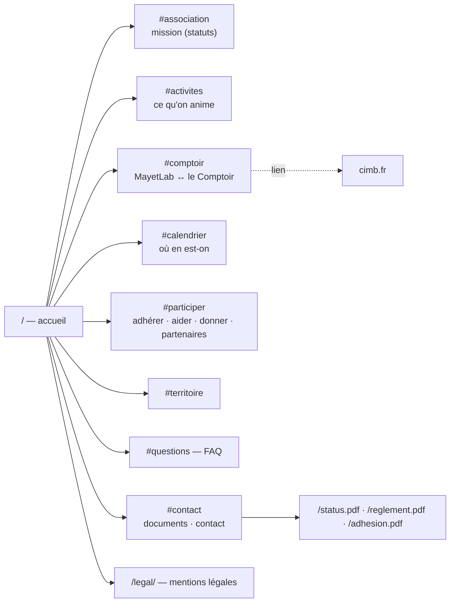

# mayetlab.fr

Site de l'association **MayetLab** (loi 1901, but non lucratif) — tiers-lieu
de la Montagne Bourbonnaise. Complémentaire de [cimb.fr](https://cimb.fr/)
(le Comptoir, CIMB SAS, qui exploite le lieu), mais distinct : ici on parle
de l'association, de sa mission et de la manière d'y participer.

## Principes

- **Pages écrites à la main**, sans générateur ni JavaScript. `public/` part
  en ligne tel quel.
- **Informatif** : mission tirée des statuts, activités, qui fait quoi entre
  MayetLab et le Comptoir, calendrier, participation, FAQ, documents.
- **Accessible** : police Atkinson Hyperlegible, contrastes AA sur tous les
  couples de couleurs, lien d'évitement, repères ARIA, FAQ en `<details>`
  natifs, focus visible, animations coupées si « moins de mouvement ».
- **Sans tiers** : polices et images servies localement, aucun cookie ni
  traceur ; HelloAsso, Google Forms et Facebook sont de simples liens.
- **L'esprit atelier conservé** : logo néon qui grésille (keyframes
  `electric` d'origine), lampes suspendues, établi, écriture à la craie,
  panneau perforé et petits bouts de scotch ; le tout passé au **vert** des
  collines de la Montagne Bourbonnaise.

## Arborescence



| Chemin | Rôle |
|---|---|
| `public/index.html` | page d'accueil (une seule page longue, ancres) |
| `public/legal/index.html` | mentions légales et données personnelles |
| `public/assets/site.css` | toute la mise en forme (jetons de couleur en tête) |
| `public/assets/fonts.css`, `public/fonts/` | polices auto-hébergées (SIL OFL) |
| `public/*.pdf` | statuts, règlement, bulletin — **à laisser à la racine**, le bulletin papier imprime ces URL |
| `public/.htaccess` | HTTPS, redirections, cache, en-têtes de sécurité (CSP stricte) |
| `tools/check-*.py` | contrôles lancés par la CI avant tout envoi |
| `tools/make-og.py` | régénère `public/assets/og.jpg` (aperçu de partage) |

## Vérifier en local

```sh
python3 -m http.server -d public 8000      # puis http://localhost:8000
python3 tools/check-third-party.py public
python3 tools/check-links.py public
python3 tools/check-csp.py public public/.htaccess
python3 tools/check-redirects.py public/.htaccess
```

## Mise en ligne

`.github/workflows/deploy.yml` — même chaîne que francoisfournier.fr :
contrôles, puis `lftp mirror` en **FTPS** vers o2switch à chaque push sur
`main`, puis vérification des URL en ligne. Lancement manuel possible en
mode simulation (`dry_run`).

Hôte et chemin sont **préremplis dans le workflow** (une variable du dépôt
du même nom les remplace si besoin) :

| Nom | Valeur | Pourquoi |
|---|---|---|
| `DEPLOY_FTP_HOST` | `filao.o2switch.net` | serveur o2switch de mayetlab.fr (109.234.166.10), nom couvert par le certificat FTPS |
| `DEPLOY_FTP_PATH` | `/` | compte FTP dédié, verrouillé sur le dossier de mayetlab.fr |

Seuls deux **secrets** restent à créer dans *Settings → Secrets and
variables → Actions → Secrets* :

| Nom | Valeur |
|---|---|
| `DEPLOY_FTP_USER` | identifiant du compte FTP dédié (cPanel → Comptes FTP, répertoire = dossier de mayetlab.fr) |
| `DEPLOY_FTP_PASSWORD` | son mot de passe — **sans virgule** |

Essai à blanc : Actions → Déploiement → Run workflow → « Simuler ». La
simulation se connecte, vérifie le certificat et la cible, et annonce ce
qu'elle transférerait et supprimerait, sans rien écrire.

> `mirror --delete` remplace tout le contenu du dossier cible : l'ancien
> site Hugo (css/, js/, img/…) sera supprimé au premier déploiement réel.
